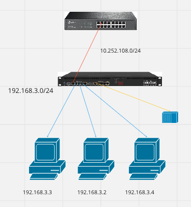
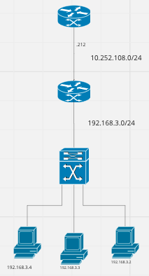

# Physical dan Logical Miro Mikrotik

Konfigurasi router dan pc :

## **1. Router 0**
    - Static
        Network     : 192.168.3.0
        Mask        : 255.255.255.0
        Next Hop    : 10.252.108.13
    - Fe 0/0
        IPv4 Address: 10.252.108.3
        Subnet Mask : 255.0.0.0

## **2. Router 1**
    - Fe 0/0
        IPv4 Address: 10.252.108.13
        Subnet Mask : 255.0.0.0
    - Fe 1/0
        IPv4 Address: 192.168.3.1
        Subnet Mask : 255.255.255.0

## **3. PC 0**
    IPv4 Address    : 192.168.3.2
    Subnet Mask     : 255.255.255.0
    Default Gateway : 192.168.3.1

## **4. PC 1**
    IPv4 Address    : 192.168.3.3
    Subnet Mask     : 255.255.255.0
    Default Gateway : 192.168.3.1

## **5. PC 2**
    IPv4 Address    : 192.168.3.4
    Subnet Mask     : 255.255.255.0
    Default Gateway : 192.168.3.1