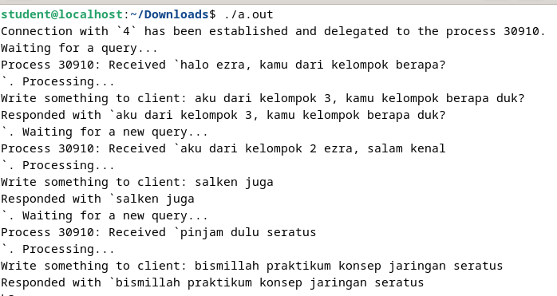

# Chat Socket Programming C

## Client Side

```
#include <stdio.h>
#include <stdlib.h>

#include <netdb.h>
#include <netinet/in.h>

#include <string.h>
#include <unistd.h>

int main(int argc, char *argv[]) {
    int sockfd, portno, n;
    struct sockaddr_in serv_addr;

    struct hostent *server;

    char buffer[256];
    portno = 5001;

    // create socket and get file descriptor
    sockfd = socket(AF_INET, SOCK_STREAM, 0);

    server = gethostbyname("192.168.3.2");

    if (server == NULL) {
        fprintf(stderr,"ERROR, no such host\n");
        exit(0);
    }

    bzero((char *) &serv_addr, sizeof(serv_addr));
    serv_addr.sin_family = AF_INET;
    bcopy((char *)server->h_addr, (char *)&serv_addr.sin_addr.s_addr, server->h_length);
    serv_addr.sin_port = htons(portno);


    // connect to server with server address which is set above (serv_addr)

    if (connect(sockfd, (struct sockaddr *)&serv_addr, sizeof(serv_addr)) < 0) {
        perror("ERROR while connecting");
        exit(1);
    }

    // inside this while loop, implement communicating with read/write or send/recv function
    while (1) {
        printf("How many character that you want to send? ");
        int charAmount;
        scanf("%d",&charAmount);

        char buffer[charAmount];
        bzero(buffer,charAmount);
        for (int i = 0; i < charAmount; i++) {
        	buffer[i] = 'n';
        }
        
        if (n < 0){
            perror("ERROR while writing to socket");
            exit(1);
        }

        bzero(buffer,charAmount);
        n = read(sockfd, buffer, charAmount);

        if (n < 0){
            perror("ERROR while reading from socket");
            exit(1);
        }
        printf("server replied: %s \n", buffer);

        // escape this loop, if the server sends message "quit"

        if (!bcmp(buffer, "quit", 4))
            break;
    }
    return 0;
}
```

### Penjelasan

Kode di atas adalah implementasi sederhana dari klien socket dalam bahasa C. Klien ini berkomunikasi dengan server menggunakan protokol TCP/IP. Berikut adalah penjelasan singkat untuk setiap bagian kodenya:

1. **Inisialisasi dan Deklarasi:**
   - `sockfd`: File descriptor untuk socket.
   - `portno`: Nomor port yang digunakan dalam koneksi.
   - `serv_addr`: Struktur untuk menyimpan alamat server.
   - `server`: Struktur `hostent` untuk mendapatkan informasi host.

2. **Membuat Socket:**
   - `sockfd = socket(AF_INET, SOCK_STREAM, 0);`: Membuat socket dengan menggunakan protokol IPv4 (AF_INET) dan tipe koneksi streaming (SOCK_STREAM).

3. **Inisialisasi Server Address:**
   - `server = gethostbyname("192.168.3.2");`: Mendapatkan informasi host berdasarkan alamat IP.
   - Inisialisasi struktur `serv_addr` dengan informasi host.

4. **Koneksi ke Server:**
   - `connect(sockfd, (struct sockaddr *)&serv_addr, sizeof(serv_addr));`: Mencoba untuk terhubung ke server dengan menggunakan alamat server yang sudah diinisialisasi.

5. **Loop Utama:**
   - Sebuah loop yang berjalan terus menerus untuk berkomunikasi dengan server.
   - Mengambil jumlah karakter yang ingin dikirim dari pengguna.
   - Menginisialisasi buffer dengan karakter 'n'.
   - Mengirim buffer ke server menggunakan `write()` atau `send()`.
   - Membaca respons dari server menggunakan `read()` atau `recv()`.
   - Memeriksa apakah respons dari server adalah "quit" untuk keluar dari loop.

6. **Penting:**
   - Ada beberapa masalah dalam kode, seperti deklarasi ulang buffer yang menyebabkan konflik variabel dan `bcmp()` yang digunakan secara tidak benar. 
   - Buffer yang digunakan untuk menyimpan karakter yang ingin dikirim seharusnya tidak dideklarasikan kembali setelah meminta jumlah karakter yang akan dikirim.
   - `n` perlu diinisialisasi sebelum digunakan untuk memastikan nilai awalnya benar.

Kode tersebut sebaiknya dimodifikasi agar dapat berfungsi dengan baik, dan juga untuk menangani potensi masalah-masalah lainnya seperti penanganan kesalahan yang lebih baik.

## Server Side

```
#include <stdio.h>
#include <stdlib.h>

#include <netdb.h>
#include <netinet/in.h>

#include <string.h>
#include <unistd.h>
#include <stdbool.h>
#include <time.h>

void bzero(void *a, size_t n) {
    memset(a, 0, n);
}

void bcopy(const void *src, void *dest, size_t n) {
    memmove(dest, src, n);
}

struct sockaddr_in* init_sockaddr_in(uint16_t port_number) {
    struct sockaddr_in *socket_address = malloc(sizeof(struct sockaddr_in));
    memset(socket_address, 0, sizeof(*socket_address));
    socket_address -> sin_family = AF_INET;
    socket_address -> sin_addr.s_addr = htonl(INADDR_ANY);
    socket_address -> sin_port = htons(port_number);
    return socket_address;
}

char* process_operation(char *input) {
    char text[256];
    printf("\nWrite something to client: ");
    fgets(text, 256, stdin);

    size_t n = strlen(text) * sizeof(char);
    char *output = malloc(n);
    memcpy(output, text, n);
    return output;
}

int main( int argc, char *argv[] ) {

    const uint16_t port_number = 10001;
    int server_fd = socket(AF_INET, SOCK_STREAM, 0);

    struct sockaddr_in *server_sockaddr = init_sockaddr_in(port_number);
    struct sockaddr_in *client_sockaddr = malloc(sizeof(struct sockaddr_in));
    socklen_t server_socklen = sizeof(*server_sockaddr);
    socklen_t client_socklen = sizeof(*client_sockaddr);


    if (bind(server_fd, (const struct sockaddr *) server_sockaddr, server_socklen) < 0)
    {
        printf("Error! Bind has failed\n");
        exit(0);
    }
    if (listen(server_fd, 3) < 0)
    {
        printf("Error! Can't listen\n");
        exit(0);
    }


    const size_t buffer_len = 256;
    char *buffer = malloc(buffer_len * sizeof(char));
    char *response = NULL;
    time_t last_operation;
    __pid_t pid = -1;

    while (1) {
        int client_fd = accept(server_fd, (struct sockaddr *) &client_sockaddr, &client_socklen);

        pid = fork();

        if (pid == 0) {
            close(server_fd);

            if (client_fd == -1) {
                exit(0);
            }

            printf("Connection with `%d` has been established and delegated to the process %d.\nWaiting for a query...\n", client_fd, getpid());

            last_operation = clock();

            while (1) {
                read(client_fd, buffer, buffer_len);

                if (buffer == "close") {
                    printf("Process %d: ", getpid());
                    close(client_fd);
                    printf("Closing session with `%d`. Bye!\n", client_fd);
                    break;
                }

                if (strlen(buffer) == 0) {
                    clock_t d = clock() - last_operation;
                    double dif = 1.0 * d / CLOCKS_PER_SEC;

                    if (dif > 5.0) {
                        printf("Process %d: ", getpid());
                        close(client_fd);
                        printf("Connection timed out after %.3lf seconds. ", dif);
                        printf("Closing session with `%d`. Bye!\n", client_fd);
                        break;
                    }

                    continue;
                }

                printf("Process %d: ", getpid());
                printf("Received `%s`. Processing... ", buffer);

                free(response);
                response = process_operation(buffer);
                bzero(buffer, buffer_len * sizeof(char));

                send(client_fd, response, strlen(response), 0);

                printf("Responded with `%s`. Waiting for a new query...\n", response);

                last_operation = clock();
            }
            exit(0);
        }
        else {
            close(client_fd);
        }
    }
}
```

### Penjelasan

Kode di atas adalah implementasi sederhana dari server socket dalam bahasa C yang menerima koneksi dari klien, menangani koneksi tersebut dalam proses anak, dan berkomunikasi dengan klien melalui socket. Berikut adalah penjelasan singkat untuk setiap bagian kodenya:

1. **Fungsi Bantu `bzero` dan `bcopy`:**
   - `bzero` digunakan untuk menginisialisasi sejumlah byte dalam suatu area memori menjadi nilai 0.
   - `bcopy` adalah fungsi yang menyalin sejumlah byte dari satu area memori ke area memori lain.

2. **Fungsi Bantu `init_sockaddr_in`:**
   - Fungsi ini digunakan untuk menginisialisasi dan mengembalikan struktur `sockaddr_in` dengan alamat dan port yang ditentukan.

3. **Fungsi `process_operation`:**
   - Fungsi ini meminta input dari pengguna, mengembalikan input tersebut dalam bentuk string dinamis.

4. **Fungsi Utama (`main`):**
   - Membuat socket server menggunakan `socket()`.
   - Menginisialisasi struktur `sockaddr_in` untuk server menggunakan fungsi bantu.
   - Membuat buffer dan variabel lainnya yang diperlukan.
   - Melakukan binding dan listening pada socket.
   - Menerima koneksi dari klien menggunakan `accept()`.
   - Membuat proses anak menggunakan `fork()` untuk menangani setiap koneksi.
   - Dalam setiap proses anak:
     - Membaca data dari klien menggunakan `read()`.
     - Menghandle operasi tertentu berdasarkan data yang diterima.
     - Mengirim respons ke klien menggunakan `send()`.
     - Menangani timeout dan menutup koneksi jika diperlukan.
   - Proses induk menutup socket klien setelah menciptakan proses anak.

5. **Penting:**
   - Ada beberapa masalah dalam kode tersebut, seperti pembandingan string menggunakan `==` (harus menggunakan `strcmp`) dan masalah terkait buffer saat memeriksa kondisi "close".

Perlu diperhatikan bahwa implementasi ini memiliki beberapa kelemahan dan tidak memperhitungkan beberapa situasi khusus yang umumnya harus ditangani dalam aplikasi jaringan yang sebenarnya. Misalnya, perlindungan terhadap race condition dan penanganan sinyal yang lebih baik.

## Hasil


