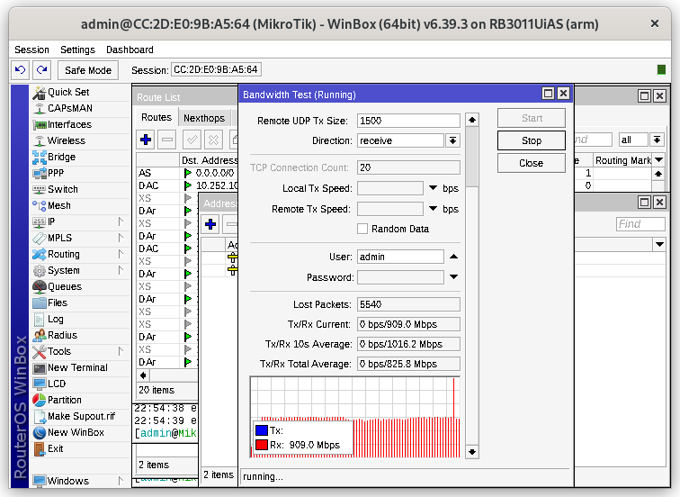

# Tes Bandwidth pada Mikrotik

Bandwidth mengacu pada kapasitas maksimum atau laju transfer data yang dapat ditangani oleh suatu jaringan atau saluran komunikasi dalam suatu periode waktu tertentu. Istilah ini umumnya digunakan untuk mengukur seberapa cepat data dapat dikirim atau diterima melalui suatu koneksi internet atau jaringan komputer.

Bandwidth diukur dalam bit per detik (bps) atau satuan yang lebih besar seperti kilobit per detik (kbps), megabit per detik (Mbps), atau gigabit per detik (Gbps), tergantung pada seberapa besar kapasitas jaringannya.

Dalam konteks internet, bandwidth dapat memengaruhi seberapa cepat suatu situs web dapat dimuat, seberapa lancar video dapat diputar, atau seberapa cepat data dapat diunduh atau diunggah. Semakin tinggi bandwidth, semakin banyak data yang dapat ditransfer dalam satu waktu, dan oleh karena itu, pengalaman pengguna dalam menggunakan layanan online dapat menjadi lebih baik.

Kecepatan upload dan download adalah dua aspek utama dari bandwidth dalam konteks koneksi internet atau jaringan komputer. Berikut adalah penjelasan singkat tentang keduanya:

Kecepatan Download: Ini mengacu pada seberapa cepat data dapat diunduh dari internet ke perangkat Anda. Misalnya, ketika Anda mengunduh file, menonton video online, atau membuka halaman web, kecepatan download akan mempengaruhi seberapa cepat konten tersebut dapat diakses.

Kecepatan Upload: Ini merujuk pada seberapa cepat data dapat diunggah dari perangkat Anda ke internet. Aktivitas seperti mengunggah file, mengirim email dengan lampiran besar, atau melakukan panggilan video memerlukan kecepatan upload yang memadai.

## Bandwith in Mikrotik

Langkah langkah mengecek Bandwith di Mikrotik:

1. Masuk ke dalam jaringan router kita.
2. Kemudian klik tombol Tools->Bandwith Test
3. Kemudian isi destination address menuju gateway kita (192.168.3.1)
4. Setelah mengisi destination address, isi user (admin) dan untuk password sesuaikan dengan kita saat akan masuk ke configurasi router kita.
5. Setelah itu klik tombol test dan akan muncul gambar seperti berikut.

