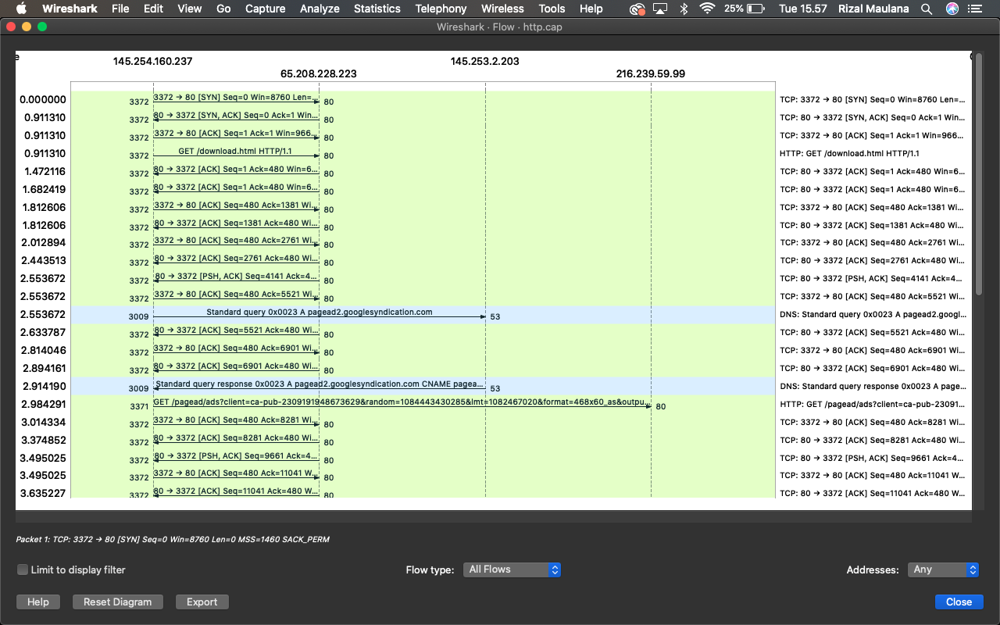
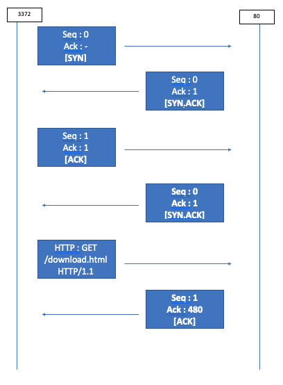
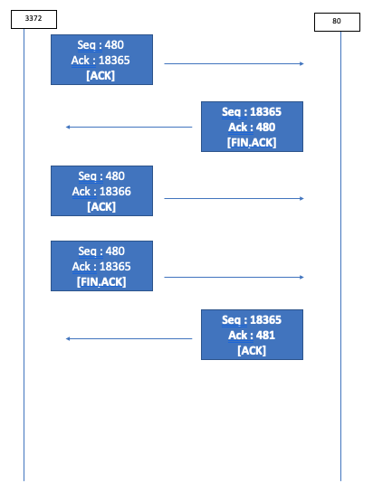

## Analisis Flow-Graph HTTP

"Flow Graph" adalah fitur visualisasi yang memungkinkan Anda melihat interaksi antara host dalam bentuk grafik. Grafik ini membantu Anda memahami bagaimana aliran (flow) data berjalan dari satu host ke host lainnya, serta bagaimana aliran tersebut berkembang dari waktu ke waktu. Berikut adalah komponen utama dari "Flow Graph":

### Connection

### Terminate

1. **Node (Node):**
- Node dalam "Flow Graph" mewakili host atau alamat IP yang terlibat dalam aliran. Ada dua jenis node: node sumber (source node) dan node tujuan (destination node).
- Setiap node ditandai dengan alamat IP atau nama host yang sesuai.
Edge (Tepian):

2. **Tepian (edge):** 
- adalah garis yang menghubungkan dua node dan mewakili aliran data antara dua host.
- Tepian biasanya memiliki arah, menunjukkan aliran data dari node sumber ke node tujuan.
- Pada tepian, Anda dapat melihat beberapa informasi tambahan, seperti jumlah paket yang ditransfer, jumlah byte yang ditransfer, dan informasi waktu terkait.

3. **Timeline (Garis Waktu):**

- Di sepanjang sumbu waktu di bagian bawah grafik, Anda dapat melihat bagaimana aliran berkembang dari waktu ke waktu.
- Grafik ini membantu Anda mengidentifikasi lonjakan lalu lintas atau periode ketika komunikasi antara host sangat intens.

4. **Warna dan Atribut Tambahan:**

- Tepian atau garis biasanya diberi warna untuk membedakan jenis protokol atau layanan yang digunakan dalam aliran.
- Beberapa fitur Wireshark juga bisa mengatur tebalnya tepian berdasarkan kriteria tertentu, seperti ukuran data yang ditransfer atau jumlah paket.

5. **Interaksi dan Informasi Kontekstual:**

- Anda bisa berinteraksi dengan grafik ini, seperti mengklik node atau tepian untuk mendapatkan informasi lebih lanjut tentang aliran tersebut.
- Informasi lebih lanjut mungkin termasuk detail paket, statistik aliran, dan atribut lainnya yang dapat membantu Anda memahami interaksi antara host.

Grafik aliran ini memberikan pandangan yang jelas tentang bagaimana komunikasi terjadi antara host dalam jaringan. Ini bisa sangat berguna untuk mengidentifikasi pola komunikasi normal, menemukan anomali, atau mengidentifikasi aliran yang mencurigakan. Namun, interpretasi grafik ini memerlukan pemahaman yang baik tentang jaringan, protokol, dan konteks situasi yang sedang dianalisis.