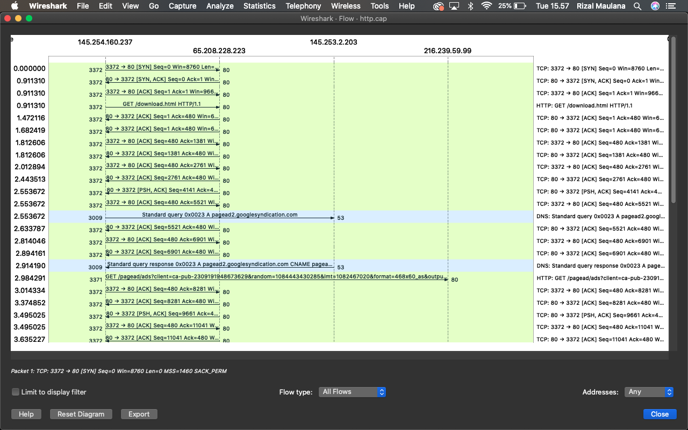
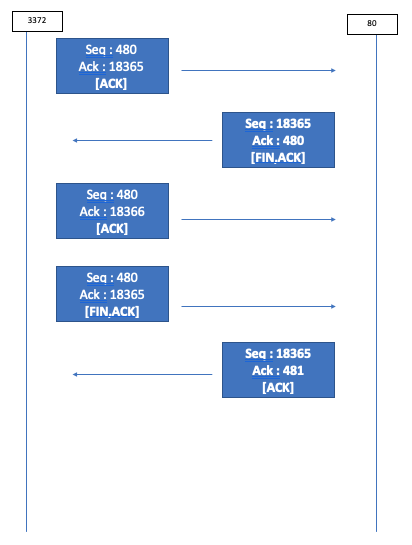
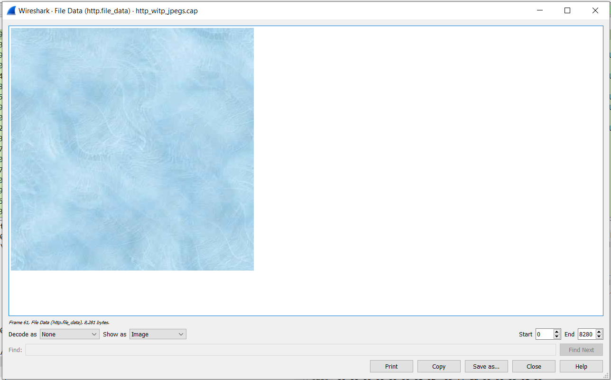
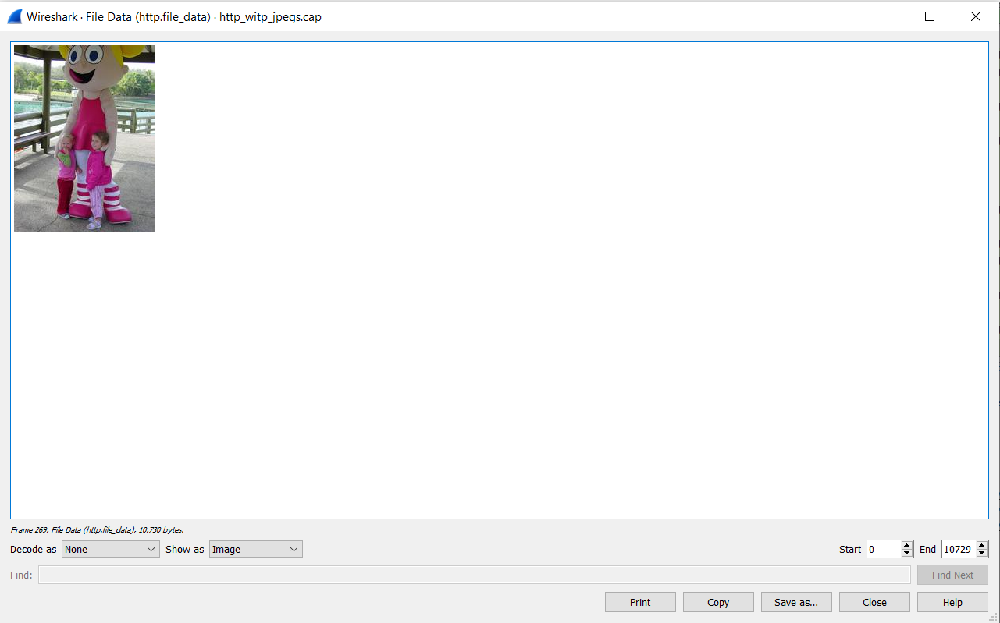
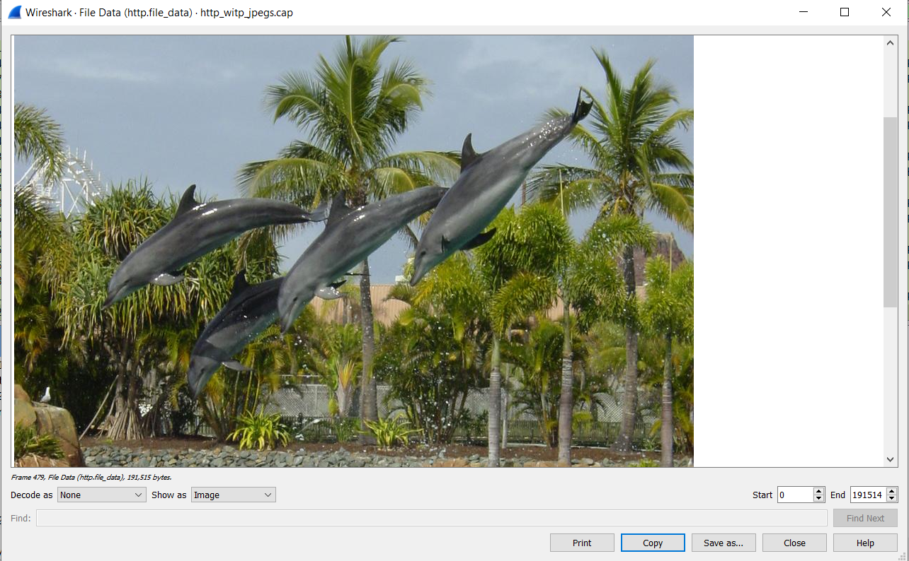

# Laporan Praktikum Minggu ke 2

1. Rizal Maulana (3122600004)
2. Ezra Septian Handyanto (3122600016)
3. Septian Achmad Rojabbi (3122600025)
    
# Analisis Flow-Graph HTTP

"Flow Graph" adalah fitur visualisasi yang memungkinkan Anda melihat interaksi antara host dalam bentuk grafik. Grafik ini membantu Anda memahami bagaimana aliran (flow) data berjalan dari satu host ke host lainnya, serta bagaimana aliran tersebut berkembang dari waktu ke waktu. Berikut adalah komponen utama dari "Flow Graph":

### Connection

### Terminate

1. **Node (Node):**
- Node dalam "Flow Graph" mewakili host atau alamat IP yang terlibat dalam aliran. Ada dua jenis node: node sumber (source node) dan node tujuan (destination node).
- Setiap node ditandai dengan alamat IP atau nama host yang sesuai.
Edge (Tepian):

2. **Tepian (edge):** 
- adalah garis yang menghubungkan dua node dan mewakili aliran data antara dua host.
- Tepian biasanya memiliki arah, menunjukkan aliran data dari node sumber ke node tujuan.
- Pada tepian, Anda dapat melihat beberapa informasi tambahan, seperti jumlah paket yang ditransfer, jumlah byte yang ditransfer, dan informasi waktu terkait.

3. **Timeline (Garis Waktu):**

- Di sepanjang sumbu waktu di bagian bawah grafik, Anda dapat melihat bagaimana aliran berkembang dari waktu ke waktu.
- Grafik ini membantu Anda mengidentifikasi lonjakan lalu lintas atau periode ketika komunikasi antara host sangat intens.

4. **Warna dan Atribut Tambahan:**

- Tepian atau garis biasanya diberi warna untuk membedakan jenis protokol atau layanan yang digunakan dalam aliran.
- Beberapa fitur Wireshark juga bisa mengatur tebalnya tepian berdasarkan kriteria tertentu, seperti ukuran data yang ditransfer atau jumlah paket.

5. **Interaksi dan Informasi Kontekstual:**

- Anda bisa berinteraksi dengan grafik ini, seperti mengklik node atau tepian untuk mendapatkan informasi lebih lanjut tentang aliran tersebut.
- Informasi lebih lanjut mungkin termasuk detail paket, statistik aliran, dan atribut lainnya yang dapat membantu Anda memahami interaksi antara host.

Grafik aliran ini memberikan pandangan yang jelas tentang bagaimana komunikasi terjadi antara host dalam jaringan. Ini bisa sangat berguna untuk mengidentifikasi pola komunikasi normal, menemukan anomali, atau mengidentifikasi aliran yang mencurigakan. Namun, interpretasi grafik ini memerlukan pemahaman yang baik tentang jaringan, protokol, dan konteks situasi yang sedang dianalisis.

# HTTP Packet Counter

HTTP packets terletak pada packet:4,18,27,38

**Pada packet 4** merupakan packet yang melakukan request berupa GET/download.html HTTP/1.1 dan akan di response **Pada packet 38**. Packet ini bertujuan untuk mengakses http://www.ethereal.com/download.html

**Pada packet 18** merupakan packet yang melakukan request berupa GET http://pagead2.googlesyndication.com/pagead/ads?client=ca-pub-2309191948673629&random=1084443430285&lmt=1082467020&format=468x60_as&output=html&url=http%3A%2F%2Fwww.ethereal.com%2Fdownload.html&color_bg=FFFFF dan akan di response oleh server **Pada packet 27**. Packet ini bertujuan untuk mengakses http://pagead2.googlesyndication.com/pagead/ads?client=ca-pub-2309191948673629&random=1084443430285&lmt=1082467020&format=468x60_as&output=html&url=http%3A%2F%2Fwww.ethereal.com%2Fdownload.html&color_bg=FFFFF.

# Jenis-jenis respons HTTP:

1. **1xx (Informational)**: Respons ini adalah informasi yang hanya memberi tahu klien bahwa permintaannya telah diterima dan diproses sebagian. Kode status ini jarang digunakan secara umum.

2. **2xx (Success)**: Respons ini menunjukkan bahwa permintaan klien telah berhasil diterima, dipahami, dan direspon dengan baik oleh server. Beberapa kode status yang termasuk dalam kategori ini adalah:

   200 OK: Permintaan berhasil dan respons berisi data yang diminta.

   201 Created: Permintaan berhasil, dan server telah membuat sumber daya baru.

   204 No Content: Permintaan berhasil, tetapi respons tidak mengandung konten. Biasanya digunakan untuk operasi tanpa respons.

3. **3xx (Redirection)**: Respons ini menunjukkan bahwa klien harus mengambil tindakan tambahan untuk menyelesaikan permintaannya. Beberapa kode status yang termasuk dalam kategori ini adalah:

   301 Moved Permanently: Sumber daya yang diminta telah pindah secara permanen ke lokasi baru.

   302 Found / 307 Temporary Redirect: Sumber daya yang diminta sementara berada di lokasi lain.

   304 Not Modified: Sumber daya tidak berubah sejak permintaan sebelumnya, sehingga klien dapat menggunakan data yang disimpan secara lokal.

4. **4xx (Client Error)**: Respons ini menunjukkan bahwa terjadi kesalahan pada permintaan klien. Beberapa kode status yang termasuk dalam kategori ini adalah:

   400 Bad Request: Permintaan klien tidak dapat dipahami oleh server karena format yang salah atau parameter yang tidak valid.

   401 Unauthorized: Klien tidak diizinkan mengakses sumber daya tanpa autentikasi.

   404 Not Found: Sumber daya yang diminta tidak ditemukan di server.

5. **5xx (Server Error)**: Respons ini menunjukkan bahwa terjadi kesalahan pada server saat mencoba memproses permintaan. Beberapa kode status yang termasuk dalam kategori ini adalah:

   500 Internal Server Error: Terjadi kesalahan pada server yang tidak dapat ditentukan dengan jelas.

   503 Service Unavailable: Server tidak dapat menangani permintaan saat ini karena alasan tertentu.

Seiring dengan respons HTTP, ada juga permintaan HTTP yang dikirim oleh klien ke server. Salah satu permintaan paling umum adalah:

GET: Permintaan untuk mengambil informasi atau data dari server. Digunakan untuk mengambil halaman web atau sumber daya lain.

Selain GET, ada juga jenis permintaan lainnya seperti:

POST: Permintaan untuk mengirimkan data kepada server, yang biasanya digunakan untuk mengirim data yang akan diolah (misalnya, saat mengisi formulir).

PUT: Permintaan untuk mengirimkan data kepada server dan menggantikan sumber daya yang ada jika ada.

DELETE: Permintaan untuk menghapus sumber daya dari server.

PATCH: Permintaan untuk memperbarui sebagian data sumber daya di server.

# PENGERTIAN DARI THROUGHPUT

Throughput mengacu pada jumlah data yang dapat ditransmisikan melalui jaringan atau saluran komunikasi dalam suatu periode waktu tertentu. Dalam konteks TCP (Transmission Control Protocol), throughput mengacu pada seberapa cepat data dapat dikirimkan dan diterima oleh pihak yang berkomunikasi melalui koneksi TCP.

Grafik throughput TCP Stream adalah representasi visual dari jumlah data yang dikirimkan dalam suatu koneksi TCP seiring berjalannya waktu. Grafik ini membantu dalam memahami seberapa efisien atau cepat data dapat ditransfer antara pengirim dan penerima. Biasanya, sumbu-x pada grafik ini mewakili waktu, sedangkan sumbu-y mewakili throughput dalam satuan tertentu, seperti megabits per detik (Mbps) atau kilobita per detik (Kbps).

Dalam grafik throughput TCP Stream, Anda mungkin akan melihat fluktuasi throughput seiring waktu. Ada beberapa faktor yang dapat memengaruhi throughput dalam koneksi TCP, termasuk:

## 1. **Congestion (Kemacetan)**
 Jika ada terlalu banyak data yang mencoba melalui jaringan pada saat yang bersamaan, hal ini dapat menyebabkan kemacetan (congestion). Ini dapat mengurangi throughput secara keseluruhan karena paket data mungkin harus menunggu giliran untuk dikirim.

## 2. **Window Size (Ukuran Jendela)**
 TCP menggunakan mekanisme pengaturan ukuran jendela untuk mengontrol seberapa banyak data yang dapat dikirimkan sebelum menerima konfirmasi. Ukuran jendela yang lebih besar dapat meningkatkan throughput dengan memungkinkan lebih banyak data dikirimkan sebelum konfirmasi diterima.

## 3. **Round-Trip Time (RTT)**
 RTT adalah waktu yang dibutuhkan oleh paket data untuk pergi dari pengirim ke penerima dan kembali sebagai tanggapan. Jarak fisik dan latensi jaringan dapat memengaruhi RTT. RTT yang lebih tinggi dapat mempengaruhi throughput karena pengirim mungkin harus menunggu lebih lama untuk menerima konfirmasi.

## 4. **Packet Loss (Kehilangan Paket)**
 Kehilangan paket dapat mengurangi throughput karena data yang hilang perlu dikirim ulang. Hal ini dapat mengurangi efisiensi dan memperlambat proses.

Grafik throughput TCP Stream berguna untuk menganalisis performa koneksi TCP, mengidentifikasi pola-pola throughput, dan mengidentifikasi masalah yang mungkin muncul dalam komunikasi jaringan. Dengan memahami grafik ini, Anda dapat mengambil tindakan yang diperlukan untuk meningkatkan kinerja jaringan, mengoptimalkan pengaturan, dan mengatasi kendala yang mungkin terjadi.

# Analisa HTTP WITP JPEG

Pada file http_witp_jpeg.cap Response yang menampilkan gambar terletak pada packet: 61,72,259,269,479

**Untuk Menampilkan gambar kita perlu:**

1. Buka File http_witp_jpeg.cap.
2. Lalu tekan CTRL+F kemudian pilih String yang sebelumnya Display Filter
3. Ketikkan 200 OK  (JPEG JFIF image) yang berarti bahwa 200 merupakan response sukses dari server dan (JPEG JFIF image) merupakan jenis file yang terkirim ke client
4. Lalu klik 1 kali package tersebut kemudian Buka Hypertext Transfer Protocol
5. Kemudian klik 1 kali dan cari File Data
6. Setelah itu klik kanan pada baris yang menunjukkan File Data dan pilih Show Packet Bytes

**Isi Packet 61:(Request Terletak Pada Packet 48)**

**Isi Packet 72:(Request Terletak Pada Packet 50)**

**Isi Packet 259:(Request Terletak Pada Packet 240)**

**Isi Packet 269:(Request Terletak Pada Packet 241)**

**Isi Packet 479:(Request Terletak Pada Packet 278)**

# PENGERTIAN DARI THROUGHPUT

Throughput mengacu pada jumlah data yang dapat ditransmisikan melalui jaringan atau saluran komunikasi dalam suatu periode waktu tertentu. Dalam konteks TCP (Transmission Control Protocol), throughput mengacu pada seberapa cepat data dapat dikirimkan dan diterima oleh pihak yang berkomunikasi melalui koneksi TCP.

Grafik throughput TCP Stream adalah representasi visual dari jumlah data yang dikirimkan dalam suatu koneksi TCP seiring berjalannya waktu. Grafik ini membantu dalam memahami seberapa efisien atau cepat data dapat ditransfer antara pengirim dan penerima. Biasanya, sumbu-x pada grafik ini mewakili waktu, sedangkan sumbu-y mewakili throughput dalam satuan tertentu, seperti megabits per detik (Mbps) atau kilobita per detik (Kbps).

Dalam grafik throughput TCP Stream, Anda mungkin akan melihat fluktuasi throughput seiring waktu. Ada beberapa faktor yang dapat memengaruhi throughput dalam koneksi TCP, termasuk:

## 1. **Congestion (Kemacetan)**
 Jika ada terlalu banyak data yang mencoba melalui jaringan pada saat yang bersamaan, hal ini dapat menyebabkan kemacetan (congestion). Ini dapat mengurangi throughput secara keseluruhan karena paket data mungkin harus menunggu giliran untuk dikirim.

## 2. **Window Size (Ukuran Jendela)**
 TCP menggunakan mekanisme pengaturan ukuran jendela untuk mengontrol seberapa banyak data yang dapat dikirimkan sebelum menerima konfirmasi. Ukuran jendela yang lebih besar dapat meningkatkan throughput dengan memungkinkan lebih banyak data dikirimkan sebelum konfirmasi diterima.

## 3. **Round-Trip Time (RTT)**
 RTT adalah waktu yang dibutuhkan oleh paket data untuk pergi dari pengirim ke penerima dan kembali sebagai tanggapan. Jarak fisik dan latensi jaringan dapat memengaruhi RTT. RTT yang lebih tinggi dapat mempengaruhi throughput karena pengirim mungkin harus menunggu lebih lama untuk menerima konfirmasi.

## 4. **Packet Loss (Kehilangan Paket)**
 Kehilangan paket dapat mengurangi throughput karena data yang hilang perlu dikirim ulang. Hal ini dapat mengurangi efisiensi dan memperlambat proses.

Grafik throughput TCP Stream berguna untuk menganalisis performa koneksi TCP, mengidentifikasi pola-pola throughput, dan mengidentifikasi masalah yang mungkin muncul dalam komunikasi jaringan. Dengan memahami grafik ini, Anda dapat mengambil tindakan yang diperlukan untuk meningkatkan kinerja jaringan, mengoptimalkan pengaturan, dan mengatasi kendala yang mungkin terjadi.