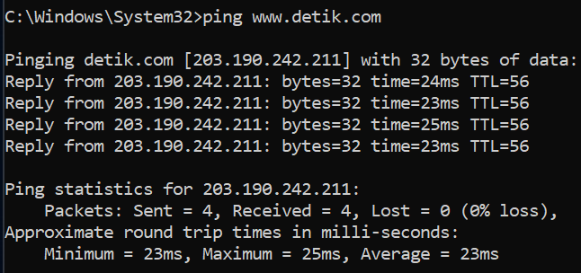
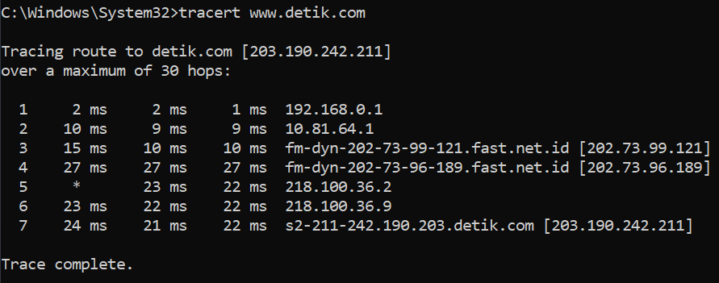

# PING DAN TRACERT
**Nama** : Aulia Ilham Nur Alfian  
**NRP** : 3122600024  
**Kelas** : 2 D4 IT A  
**Mata Kuliah** : Konsep Jaringan  
## Ping

Perintah ping adalah suatu instruksi yang digunakan untuk menguji konektivitas jaringan dan mengukur latensi (waktu tempuh) antara komputer dan suatu target, yang umumnya berupa alamat IP atau nama domain. Fungsi utama dari perintah ini adalah untuk memeriksa apakah suatu komputer dapat terhubung dengan suatu tujuan melalui jaringan tertentu dan juga untuk memantau stabilitas jaringan.

Perintah ping memiliki kemampuan untuk menampilkan berbagai informasi, termasuk:

1. Waktu Respon (Round-Trip Time/RTT): Ini merujuk pada periode waktu yang dibutuhkan oleh paket data untuk pergi dari komputer pengirim ke tujuan yang dituju, dan kemudian kembali lagi. Waktu ini diukur dalam milidetik (ms).

2. Jumlah paket yang dikirim, diterima, dan hilang: Perintah ping akan menghitung jumlah paket yang telah dikirimkan, jumlah paket yang berhasil diterima oleh tujuan, serta jumlah paket yang hilang atau tidak berhasil sampai ke tujuan.

3. Statistik ping: Setelah proses ping selesai, perintah ini akan menampilkan statistik yang mencakup rata-rata waktu respon dan persentase paket yang hilang dalam perjalanannya.

Berikut ini contoh keluaran dari perintah ping:

Dalam contoh di atas, perintah ping digunakan untuk menguji konektivitas ke situs web detik.com, yang memiliki alamat IP 103.49.221.211.

1. Proses Ping ke detik.com [103.49.221.211] dengan pengiriman paket data sebesar 32 byte: Ini adalah pesan permulaan yang menyatakan bahwa operasi ping dilakukan menuju alamat IP 103.49.221.211 dengan mengirimkan paket data berukuran 32 byte.

2. Respon dari 103.49.221.211: bytes=32 time=15ms TTL=56: Ini merupakan balasan dari alamat IP 103.49.221.211 terhadap permintaan ping yang dikirimkan. Terdapat empat baris respon yang menunjukkan bahwa keempat paket yang dikirim telah berhasil diterima oleh tujuan.
   - bytes=32 menunjukkan bahwa ukuran paket yang dikirim adalah 32 byte.
   - time=15ms menunjukkan bahwa waktu respon (Round-Trip Time/RTT) dari alamat IP 103.49.221.211 adalah sekitar 15 milidetik (ms).
   - TTL=56 adalah nilai Time-to-Live (TTL) yang menunjukkan berapa banyak hop (rute perantara) yang dilewati oleh paket sebelum mencapai tujuan. Nilai TTL ini akan berkurang setiap kali paket melewati router, dan jika mencapai nol, paket akan dihapus.

3. Statistik ping untuk 103.49.221.211: Bagian ini memberikan statistik hasil uji ping yang dilakukan.
   - Paket: Terkirim = 4 menunjukkan bahwa 4 paket ping telah terkirim.
   - Diterima = 4 menunjukkan bahwa seluruh 4 paket tersebut berhasil diterima oleh tujuan.
   - Hilang = 0 (0% hilang) menandakan bahwa tidak ada paket yang hilang selama pengujian ini, sehingga tidak ada paket yang gagal mencapai tujuan.

4. Estimasi waktu respon sekitar milidetik: Bagian ini memberikan informasi mengenai waktu respon rata-rata dari semua paket ping yang dikirim.
   - Minimum = 14ms menunjukkan waktu respon minimum, yaitu 14 ms.
   - Maximum = 15ms menunjukkan waktu respon maksimum, yaitu 15 ms.
   - Rata-rata = 14ms menunjukkan waktu respon rata-rata dari keempat paket ping yang telah dikirimkan, yakni sekitar 14 ms.

Hasil ini mengindikasikan bahwa koneksi ke detik.com (dengan alamat IP 103.49.221.211) berjalan baik, dengan seluruh paket ping berhasil mencapai tujuan tanpa ada yang hilang. Waktu respon juga relatif cepat, dengan rata-rata sekitar 14 ms, yang menunjukkan koneksi yang responsif ke situs tersebut.

## Tracert

Perintah tracert digunakan untuk menyajikan data terkait beberapa titik perantara (hop), yang menggambarkan jalur yang diikuti oleh paket data dari komputer menuju tujuan. Proses ini akan terus berlanjut hingga mencapai tujuan yang dituju atau mencapai batasan maksimal jumlah titik perantara (jumlah ini dapat ditetapkan dengan menggunakan opsi -h). Apabila suatu titik perantara tidak merespons permintaan ICMP, akan ditampilkan sebagai tanda asterisk (*), yang menandakan bahwa waktu telah habis (timeout).

Berikut adalah penjabaran untuk masing-masing kolom dalam perintah tracert:

1. **Nomor Hop:** Ini adalah nomor urutan yang diberikan kepada setiap titik (hop) dalam jalur. Dimulai dari angka 1 untuk titik pertama (router lokal) dan akan terus bertambah 1 untuk setiap titik berikutnya.

2. **RTT (Round-Trip Time):** Kolom ini menampilkan waktu yang diperlukan untuk sebuah paket ICMP (Internet Control Message Protocol) dalam perjalanan dari komputer menuju titik hop tertentu dan kembali lagi. Waktu ini diukur dalam milidetik (ms). RTT mencakup seluruh durasi yang dibutuhkan oleh paket dalam perjalanannya menuju titik tersebut serta saat menerima respons.

3. **Alamat IP:** Kolom ini menampilkan alamat IP dari router atau perangkat yang berada di setiap titik dalam jalur. Informasi ini berguna untuk mengidentifikasi perangkat jaringan khusus yang dilewati oleh paket dalam perjalanannya.

4. **Nama Host (jika tersedia):** Apabila router atau perangkat di titik hop tersebut memiliki catatan DNS terbalik (nama host), perintah tracert akan berupaya menampilkan informasi ini. Hal ini membantu dalam mengidentifikasi penyedia jaringan atau lokasi yang terkait dengan titik hop tersebut.

Berikut ini contoh keluaran dari perintah tracert:

1. **Hop 1:** Pada titik hop pertama, terjadi "Request timed out." Ini menandakan bahwa perangkat atau router pertama dalam jalur (mungkin merupakan router lokal) tidak merespons permintaan ICMP yang dikirim oleh perintah tracert. Karena ini adalah titik awal perjalanan, tracert tidak dapat menentukan RTT atau alamat IP untuk titik hop ini.

2. **Hop 2:** Pada titik hop kedua, terlihat bahwa waktu tempuh (RTT) sekitar 3 ms. Hal ini mengindikasikan bahwa paket ICMP berhasil mencapai router atau perangkat kedua dalam jalur, yang memiliki alamat IP 10.65.192.1. Hop ini adalah langkah pertama dalam perjalanan melalui jaringan setelah meninggalkan router lokal.

3. **Hop 3-6:** Titik hop ketiga hingga keenam juga menunjukkan variasi RTT, yang menandakan bahwa paket ICMP telah berhasil mencapai beberapa router atau perangkat dalam jaringan. Setiap titik hop memiliki alamat IP yang berbeda, yang kemungkinan merepresentasikan router atau perangkat yang berbeda dalam jalur menuju tujuan. Alamat IP-alamat IP ini adalah 172.16.88.165, 172.20.0.2, 172.20.0.33, dan 202.80.208.34.

4. **Hop 7:** Pada titik hop ketujuh, RTT sekitar 15 ms dan alamat IP-nya adalah 123.108.8.172. Ini menandakan bahwa paket ICMP telah mencapai titik hop yang lebih dalam dalam jaringan, dan koneksi masih berjalan dengan baik.

5. **Hop 8 (Tujuan):** Titik hop terakhir adalah tujuan yang ingin dilacak, yaitu s211-cast-211-221-49-103.detik.com dengan alamat IP 103.49.221.211. Ini merupakan alamat tujuan akhir yang ingin dicapai.