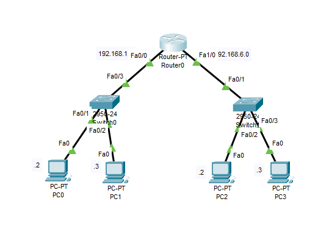
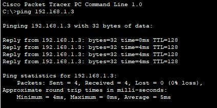
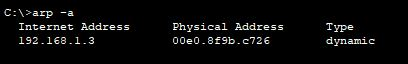
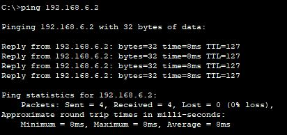
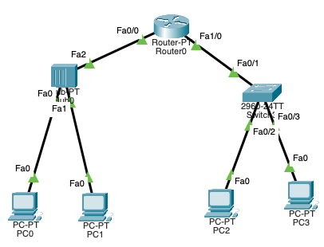

## TRACE PING

    Nama		: Rizal Maulana
    NRP		: 3122600004
    Kelas		: 2 D4 Teknik Informatika A
    Mata Kuliah	: Konsep Jaringan
    Dosen Pengampu	: Dr. Ferry Astika Saputra ST, M.Sc

### A. KONFIGURASI 1 ROUTER, 2 SWITCH & 4 PC

<strong>Gambar :</strong> konfigurasi jaringan

Pada percobaan konfigurasi jaringan dengan Packet Tracer yang pertama, digunakna 1 router, 2 switch dan 4 PC.
Berikut adalah konfigurasi dari peragkat yang digunakna :

1. Menggunakan Router-PT, dimana terdapat dua netwrok id yang terhubung yaitu 192.168.1.0 dengan konfigurasi FastEthernet(Fa) 0/0 serta 192.168.6.0 dengan konfigurasi FastEthernet(Fa) 0/1.
2. Lakukan konfigurasi pada keempat PC dengan IP Address sebagai berikut :

   - PC0 => 192.168.1.2
   - PC1 => 192.168.1.3
   - PC2 => 192.168.6.2
   - PC3 => 192.168.6.3

3. Hubungkan seluruh komponen jaringan yang ada dengan menggunakan kabel tipe straight seperti yang terlihat pada gambar di atas. Jangan lupa meng-onkan seluruh jaringan hingga ada tanda segitiga warna hijau.

**Melakukuan Ping Test**
Setelah selesai melakukan konfigurasi, selanjutnya adalah melakukan Ping test.

**1. Ping 192.168.1.2 -> 192.168.1.3 (Broadcast)**

<strong>Gambar :</strong> Ping 1

Ketika perintah ping pertama kali dijalankan, maka akan terjadi broadcast dimana jika menggunakan switch broadcast hanya akan dijalankan sekali di awal ketika ingin menghubungkan suatu perangkat yang mana berfungsi untuk mencari dimana ip address yang dituju, setelah mendapatkan address yang dituju perangkat pengirim ping akan mendapatkan konfirmasi dan selanjutnya akan mengirim sebanyak 4 packets ke address yang dituju.

**2. Ping 192.168.1.2 -> 192.168.1.3**

<strong>Gambar :</strong> Ping 2

Prosesnya sama saja dengan yang pertama, hanya saja pada ping ke 2 ke address yang sama, jika kita gunakan switch maka tidak akan ada proses broadcast kembali karena MAC sudah tersimpan sehingga memungkinkan mengirim packets kembali tanpa dijalankan broadcast.

<strong>Gambar :</strong> perintah arp

**_Dengan perintah tersebut kita dapat mendapat informasi tentang bagaimana sistem mengaitkan alamat IP dengan alamat MAC untuk perangkat lain di jaringan_**

**3. Ping 192.168.1.2 -> 192.168.6.2 (Broadcast)**

<strong>Gambar :</strong> Ping 3

Ketika perintah ping pertama kali dijalankan, maka akan terjadi broadcast dimana jika menggunakan switch broadcast hanya akan dijalankan sekali di awal ketika ingin menghubungkan suatu perangkat yang mana berfungsi untuk mencari dimana ip address yang dituju, setelah mendapatkan address yang dituju perangkat pengirim ping akan mendapatkan konfirmasi dan selanjutnya akan mengirim sebanyak 4 packets ke address yang dituju.
Pada gambar diatas terjadi Request Time Out (RTO) sebanyak satu kali, hal tersebut terjadi karena ARP Caching, dimana ketika pertama kali mencoba berkomunikasi dengan host yang baru sehingga memicu proses ARP mencari address tujuan. Pada koneksi pertama akan membutuhkan proses yang lumayan lama, namun pada proses berkitnya reply-reply akan didapat dengan cepat.

**4. Ping 192.168.1.2 -> 192.168.6.3**

<strong>Gambar :</strong> Ping 4

Prosesnya sama saja dengan yang ketiga, hanya saja pada ping ke 2 ke address yang sama, jika kita gunakan switch maka tidak akan ada proses broadcast kembali karena MAC sudah tersimpan sehingga memungkinkan mengirim packets kembali tanpa dijalankan broadcast.**_(Tidak terjadi RTO karena address tujuan sudah dikenali)_**

<strong>Gambar :</strong> Pengggunaan PT-Hub

**5. Ping 192.168.1.2 -> 192.168.1.3 (PT-Hub)**

Selanjutnya akan dilakukan percobaan dengan mengganti Switch dengan PT-Hub.

<strong>Gambar :</strong> Ping 5

Dari simulasi di atas, yang membedakan antara penggunaan Switch dengan PT-Hub adalah hub akan melakukan broadcast ke semua perangkat yang terhubung setiap kali data dikirim, bahkan jika hanya satu perangkat yang merupakan tujuan data. Sehingganmenyebabkan lalu lintas yang tidak efisien.